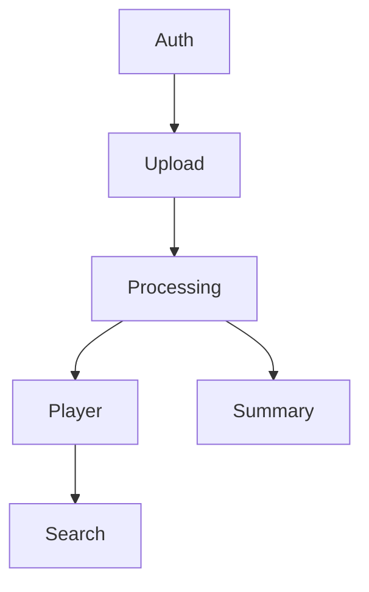

# PRD Structure Example

````markdown
# Product Name

## 1. Executive Summary

[Content in English...]

## 2. Problem and Opportunity

[Content in English...]

## 3. Target Audience

### Primary Users

**User Profile Name**
- Characteristic 1
- Characteristic 2
- Characteristic 3

### Behavioral Profile

[Common characteristics...]

## 4. Objectives

[Content in English...]

## 5. User Stories

### F01. Authentication System
- As a user, I want to register with email and password so that I can access the platform
- As a user, I want to log in so that I can access my content

### F02. Video Upload
- As a user, I want to drag files into a drop zone so that upload starts immediately
- As a user, I want to see upload progress so that I know when it finishes

### F03. Background Processing
- As the system, I want to automatically process uploaded videos so that transcriptions are available within the SLA
- As a user, I want to see processing progress so that I know when my video will be ready

### F04. Video Player
- As a user, I want to click a transcription segment to jump to that moment in the video
- As a user, I want the current segment highlighted as the video plays

### F05. Transcription Search
- As a user, I want to search within a transcription to find specific topics
- As a user, I want to click a search result to jump to that moment in the video

### F06. AI Summary
- As a user, I want to see an AI-generated summary of my video so that I can understand its content without watching

## 6. Functionalities

### F01. Authentication System

**Capabilities:** [limits, formats, rules]

**Experience:** [detailed flow]

**Error Handling:** [3-5 scenarios - ONLY for critical features]

### F02. Video Upload

**Provides:**
- Uploaded video file path and metadata (used by F03)

**Capabilities:** [limits, formats, rules]

**Experience:** [detailed flow]

**Error Handling:** [3-5 scenarios - ONLY for critical features]

### F03. Background Processing

**Consumes:**
- F02: uploaded video file path and metadata

**Provides:**
- Transcription segments with start/end timestamps, detected language, video file path (used by F04)
- Structured summary text (used by F06)

**Core Scope:**
- Video validation, audio extraction, transcription via Whisper, summary generation

**Full Scope additions:**
- Advanced retry strategies, priority queue processing

**Capabilities:** [limits, formats, rules]

**Experience:** [detailed flow]

**Error Handling:** [3-5 scenarios - ONLY for critical features]

### F04. Video Player

**Consumes:**
- F03: transcription segments with start/end timestamps, video file path, detected language

**Provides:**
- Transcription panel with segments and playback position (used by F05)

**Capabilities:** [limits, formats, rules]

**Experience:** [detailed flow]

### F05. Transcription Search

**Consumes:**
- F04: transcription panel with segments, playback position for seek-on-click

**Capabilities:** [limits, formats, rules]

**Experience:** [detailed flow]

### F06. AI Summary

**Consumes:**
- F03: structured summary text

**Capabilities:** [limits, formats, rules]

**Experience:** [detailed flow]

## 7. Out of Scope

[Content in English...]

## 8. Dependency Graph

| # | Feature | Priority | Dependencies |
|---|---------|----------|--------------|
| F01 | Authentication System | 1 | None |
| F02 | Video Upload | 1 | F01 |
| F03 | Background Processing | 1 | F02 |
| F04 | Video Player | 1 | F03 |
| F05 | Transcription Search | 2 | F04 |
| F06 | AI Summary | 1 | F03 |

### Foundation Features
These features set up shared project infrastructure. In a greenfield project they must be implemented sequentially before or alongside any feature that depends on them:
- **F01 Authentication System** — scaffolds the base app (framework scaffolding, layout, routing) and the auth layer (db schema, session middleware)

### Execution Waves
Features within the same wave can be built in parallel. A wave starts only after every feature in earlier waves is complete.

**Note:** Foundation features (see "Foundation Features" above) cannot run in parallel in a greenfield project even if they appear together in a wave — they share scaffolding files and must be implemented sequentially until the base is in place.

- **Wave 1**: F01
- **Wave 2**: F02
- **Wave 3**: F03
- **Wave 4**: F04, F06
- **Wave 5**: F05

### Priority levels
- **1** = Essential — product does not work without it
- **2** = Important — significant value addition
- **3** = Desirable — incremental improvement



## 9. Acceptance Criteria

### F01. Authentication System
- [ ] User can register with valid email and password
- [ ] Login fails with generic error on wrong credentials

### F02. Video Upload
- [ ] User can upload files up to 2GB
- [ ] Progress shows filename, percentage, and speed

### F03. Background Processing
- [ ] After upload completes, video automatically enters processing pipeline
- [ ] Processing progress shows distinct stages

### F04. Video Player
- [ ] Clicking a transcription segment seeks video to that moment
- [ ] Current segment is highlighted during playback

### F05. Transcription Search
- [ ] Search highlights all matching segments
- [ ] Clicking a match seeks video to that timestamp

### F06. AI Summary
- [ ] Summary displays below video player after processing completes
- [ ] Summary contains paragraph overview and key topics

### Cross-Feature Integration
- [ ] Uploaded video file (F02) is correctly received and processed by pipeline (F03)
- [ ] Transcription segments from processing (F03) display correctly in player (F04) with timestamps
- [ ] Player transcription panel and playback position (F04) enable search-and-seek in search (F05)
- [ ] Structured summary from processing (F03) renders correctly in summary section (F06)
````
