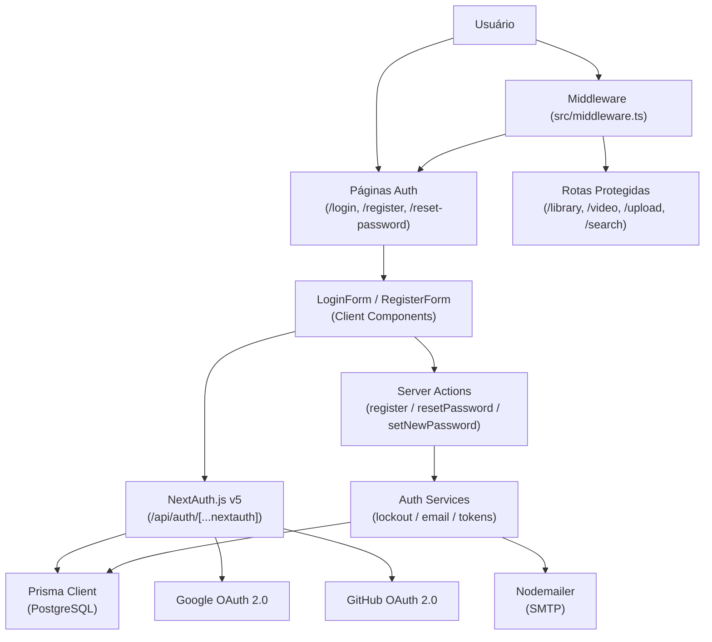

# Especificação Técnica: F01 - Sistema de Autenticação

## 1. Visão Geral Técnica

**O quê:** Implementação completa do sistema de autenticação da plataforma VideoMax, cobrindo registro por email/senha, login social via Google e GitHub, gerenciamento de sessão por JWT em cookie HTTP-only, recuperação de senha por link de email e bloqueio de conta por tentativas consecutivas falhas.

**Por quê:** F01 é a feature fundacional do projeto. Ela inicializa o framework de aplicação (Next.js App Router), o banco de dados e ORM (Prisma + PostgreSQL), define as convenções de roteamento, configura o middleware de autenticação (NextAuth.js v5) e estabelece os layouts global público e autenticado utilizados por todas as páginas subsequentes.

**Escopo:**
- **Incluído:** registro email/senha; login social Google e GitHub; sessão JWT stateless em cookie HTTP-only (7 dias, auto-renovação); recuperação de senha com link válido por 1 hora; bloqueio de login por 15 minutos após 5 tentativas falhas consecutivas; middleware de proteção de rotas; layout público e layout autenticado com navbar global
- **Excluído:** autenticação multifator (MFA); login por magic link; gerenciamento de perfil de usuário; permissões granulares por role; verificação de email após registro

---

## 2. Impacto na Arquitetura

**Componentes afetados:**

**Frontend:**

| Caminho do Arquivo | Status | Propósito | Responsabilidades Principais |
|--------------------|--------|-----------|------------------------------|
| `src/app/(auth)/layout.tsx` | Novo | Layout público | Container centralizado sem navbar autenticada; aplica-se a /login, /register, /reset-password |
| `src/app/(auth)/login/page.tsx` | Novo | Página de login | Renderiza LoginForm + SocialButtons; redireciona para /library se já autenticado |
| `src/app/(auth)/register/page.tsx` | Novo | Página de registro | Renderiza RegisterForm; redireciona para /library se já autenticado |
| `src/app/(auth)/reset-password/page.tsx` | Novo | Solicitar reset | Formulário de email para disparo do link de recuperação |
| `src/app/(auth)/reset-password/confirm/page.tsx` | Novo | Confirmar nova senha | Lê token da query string, valida, exibe formulário de nova senha, auto-login após sucesso |
| `src/app/(app)/layout.tsx` | Novo | Layout autenticado | Navbar global com campo de busca (stub); proteção via middleware; base para todas as páginas protegidas |
| `src/app/(app)/library/page.tsx` | Novo | Biblioteca (stub) | Conteúdo mínimo para validar o redirect pós-login; será expandida em F04 |
| `src/components/auth/LoginForm.tsx` | Novo | Formulário de login | Campos email/senha com validação inline; submissão via signIn('credentials'); exibição de erros de credencial e lockout |
| `src/components/auth/RegisterForm.tsx` | Novo | Formulário de registro | Campos name/email/password; validação inline antes do submit; chama Server Action register() |
| `src/components/auth/ResetPasswordForm.tsx` | Novo | Formulário de recuperação | Dois estados: solicitar email / definir nova senha com confirmação |
| `src/components/auth/SocialButtons.tsx` | Novo | Botões OAuth | Inicia fluxo Google e GitHub via signIn('google') e signIn('github') |

**Backend:**

| Caminho do Arquivo | Status | Propósito | Responsabilidades Principais |
|--------------------|--------|-----------|------------------------------|
| `src/lib/auth.ts` | Novo | Configuração NextAuth | Define providers (Credentials, Google, GitHub), callbacks JWT/session, Prisma adapter, lógica de lockout no authorize() |
| `src/lib/db.ts` | Novo | Cliente Prisma | Instância singleton do Prisma Client com cache para dev (evitar hot-reload connections) |
| `src/server/auth/actions.ts` | Novo | Server Actions | register(): cria usuário com senha hasheada; resetPassword(): gera token e envia email; setNewPassword(): valida token e atualiza senha |
| `src/server/auth/services.ts` | Novo | Serviços de auth | checkLockout(); recordFailedAttempt(); clearAttempts(); generateResetToken(); validateResetToken(); sendResetEmail() |
| `src/middleware.ts` | Novo | Middleware de rotas | Intercepta requisições; redireciona para /login se sem sessão válida nas rotas protegidas |
| `src/app/api/auth/[...nextauth]/route.ts` | Novo | Handler NextAuth | Expõe endpoints GET/POST para NextAuth (signIn, signOut, callback, session) |

**Database:**

| Arquivo de Migração | Tabelas Afetadas | Operação | Notas |
|--------------------|-----------------|----------|-------|
| `prisma/migrations/001_init_auth/migration.sql` | User, Account, VerificationToken, LoginAttempt | CREATE | Schema completo via NextAuth Prisma Adapter + tabela customizada de lockout |



---

## 3. Decisões Técnicas

| Decisão | Abordagem Escolhida | Alternativa Considerada | Trade-off |
|---------|---------------------|------------------------|-----------|
| Biblioteca de autenticação | NextAuth.js v5 (Auth.js) | Lucia Auth, implementação própria | NextAuth tem suporte nativo a OAuth, JWT, Prisma adapter e cookie seguro — menos controle sobre detalhes internos |
| Armazenamento de sessão | JWT em HTTP-only cookie (stateless) | Sessões em banco de dados (stateful) | Stateless elimina consulta ao DB por request; revogação imediata exigiria blacklist |
| Mecanismo de lockout | Tabela `LoginAttempt` no PostgreSQL | Redis com TTL | Sem dependência extra de Redis para o ambiente de execução local; levemente menos eficiente em alta concorrência |
| Serviço de email | Nodemailer + SMTP local via Mailpit (dev) | Resend API | Zero dependência externa para execução local; troca para Resend em produção via variável de ambiente |
| Hash de senha | bcrypt (cost factor 12) | argon2id | bcrypt amplamente suportado no ecossistema Node; argon2 é marginalmente mais seguro mas requer binários nativos |
| Estrutura de pastas auth | Route Groups: (auth) e (app) | Prefixo /auth/* manual | Route Groups permitem layouts distintos sem prefixo na URL; convenção padrão do Next.js App Router |

---

## 4. Visão Geral dos Componentes

**Frontend:**

| Caminho do Arquivo | Status | Propósito | Responsabilidades Principais |
|--------------------|--------|-----------|------------------------------|
| `src/app/(auth)/layout.tsx` | Novo | Layout público | Container centralizado, fundo neutro, sem navbar |
| `src/app/(auth)/login/page.tsx` | Novo | Página de login | Composição de LoginForm e SocialButtons; verificação de sessão no servidor |
| `src/app/(auth)/register/page.tsx` | Novo | Página de registro | Composição de RegisterForm; link para /login |
| `src/app/(auth)/reset-password/page.tsx` | Novo | Solicitar reset | Estado único: input de email + botão enviar |
| `src/app/(auth)/reset-password/confirm/page.tsx` | Novo | Nova senha | Lê `?token=` da URL; valida no servidor; renderiza formulário de nova senha |
| `src/app/(app)/layout.tsx` | Novo | Layout autenticado | Navbar com logo, search bar stub e avatar; SessionProvider |
| `src/app/(app)/library/page.tsx` | Novo | Biblioteca stub | Placeholder "Sua biblioteca está vazia" para validar redirect |
| `src/components/auth/LoginForm.tsx` | Novo | Formulário login | Client Component; react-hook-form + zod; estados loading/error/lockout |
| `src/components/auth/RegisterForm.tsx` | Novo | Formulário registro | Client Component; react-hook-form + zod; chama register() Server Action |
| `src/components/auth/ResetPasswordForm.tsx` | Novo | Formulário reset | Client Component; dois modos (email / nova senha) |
| `src/components/auth/SocialButtons.tsx` | Novo | OAuth buttons | Botões "Continuar com Google" e "Continuar com GitHub" |

**Backend:**

| Caminho do Arquivo | Status | Propósito | Responsabilidades Principais |
|--------------------|--------|-----------|------------------------------|
| `src/lib/auth.ts` | Novo | Config NextAuth | Providers, callbacks JWT (adiciona userId ao token), callbacks session, Prisma adapter |
| `src/lib/db.ts` | Novo | Prisma singleton | `globalThis.__prisma` pattern para evitar múltiplas conexões em dev |
| `src/server/auth/actions.ts` | Novo | Server Actions | Validação com zod, orquestração de serviços, retorno de `{ success }` ou `{ error }` |
| `src/server/auth/services.ts` | Novo | Lógica de negócio | Funções puras e testáveis: lockout, tokens de reset, envio de email |
| `src/middleware.ts` | Novo | Proteção de rotas | Exporta `auth` do NextAuth como middleware; matcher para rotas protegidas |
| `src/app/api/auth/[...nextauth]/route.ts` | Novo | NextAuth handler | Re-exporta `{ GET, POST }` de `src/lib/auth.ts` |

**Database:**

| Arquivo de Migração | Tabelas Afetadas | Operação | Notas |
|--------------------|-----------------|----------|-------|
| `prisma/migrations/001_init_auth/migration.sql` | User, Account, VerificationToken, LoginAttempt | CREATE | Gerado via `prisma migrate dev --name init_auth` |

---

## 5. Contratos de API

### Registro de Usuário (Server Action)

- **Função:** `register()` em `src/server/auth/actions.ts`
- **Invocação:** Client Component via `"use server"`
- **Autenticação:** Nenhuma

**Request:**

| Campo | Tipo | Obrigatório | Validação | Descrição |
|-------|------|-------------|-----------|-----------|
| `name` | `string` | Sim | 2–100 caracteres | Nome de exibição do usuário |
| `email` | `string` | Sim | formato email válido | Email único na plataforma |
| `password` | `string` | Sim | min 8 chars, ao menos 1 número | Senha do usuário |

**Request Example:**
```json
{
  "name": "João Silva",
  "email": "joao@example.com",
  "password": "MinhaS3nha"
}
```

**Response (Sucesso):**
```json
{ "success": true }
```

**Response (Erro):**
```json
{ "error": "EMAIL_TAKEN" }
```

**Error Codes:**

| Código | Descrição |
|--------|-----------|
| `EMAIL_TAKEN` | Email já possui conta cadastrada |
| `VALIDATION_ERROR` | Campos não passam na validação zod |

---

### Login com Credenciais (NextAuth)

- **Método:** POST
- **Caminho:** `/api/auth/callback/credentials`
- **Autenticação:** Nenhuma (pré-autenticação)

**Request:**

| Campo | Tipo | Obrigatório | Descrição |
|-------|------|-------------|-----------|
| `email` | `string` | Sim | Email do usuário |
| `password` | `string` | Sim | Senha do usuário |
| `csrfToken` | `string` | Sim | Token CSRF gerado pelo NextAuth |

**Request Example:**
```json
{
  "email": "joao@example.com",
  "password": "MinhaS3nha",
  "csrfToken": "abc123def456..."
}
```

**Response (Sucesso — 302):** Redirect para `/library` com cookie `__Secure-next-auth.session-token` (HTTP-only, SameSite=Lax, Secure em produção).

**Response (Erro — 302):** Redirect para `/login?error=CredentialsSignin`.

**Mapeamento de erro → mensagem exibida:**

| Valor de `error` | Mensagem exibida | Cenário |
|-----------------|-----------------|---------|
| `CredentialsSignin` | "Email or password is incorrect." | Credenciais inválidas |
| `CredentialsSignin` | "Too many attempts. Try again in 15 minutes." | Conta bloqueada (detectado no authorize()) |

---

### Solicitar Reset de Senha (Server Action)

- **Função:** `resetPassword()` em `src/server/auth/actions.ts`
- **Autenticação:** Nenhuma

**Request:**

| Campo | Tipo | Obrigatório | Validação | Descrição |
|-------|------|-------------|-----------|-----------|
| `email` | `string` | Sim | formato email válido | Email para envio do link |

**Nota de segurança:** Sempre retorna sucesso, mesmo se o email não existir, para evitar enumeração de usuários.

**Response (sempre sucesso):**
```json
{ "success": true }
```

---

### Confirmar Nova Senha (Server Action)

- **Função:** `setNewPassword()` em `src/server/auth/actions.ts`
- **Autenticação:** Nenhuma (autenticado via token de reset)

**Request:**

| Campo | Tipo | Obrigatório | Validação | Descrição |
|-------|------|-------------|-----------|-----------|
| `token` | `string` | Sim | UUID presente na URL | Token de reset |
| `password` | `string` | Sim | min 8 chars, ao menos 1 número | Nova senha |

**Request Example:**
```json
{
  "token": "550e8400-e29b-41d4-a716-446655440000",
  "password": "NovaSenha4"
}
```

**Response (Sucesso):**
```json
{ "success": true }
```

**Response (Erro):**
```json
{ "error": "TOKEN_EXPIRED" }
```

**Error Codes:**

| Código | Status | Descrição |
|--------|--------|-----------|
| `TOKEN_EXPIRED` | — | Token expirado ou já utilizado |
| `TOKEN_INVALID` | — | Token não encontrado no banco |
| `VALIDATION_ERROR` | — | Nova senha não atende os requisitos |

---

## 6. Modelo de Dados

**Tabela: `User`** (gerenciada pelo NextAuth Prisma Adapter)

| Coluna | Tipo | Nullable | Default | Descrição |
|--------|------|----------|---------|-----------|
| `id` | `TEXT` | Não | `cuid()` | Chave primária |
| `name` | `TEXT` | Sim | — | Nome de exibição |
| `email` | `TEXT` | Sim | — | Email único |
| `emailVerified` | `TIMESTAMPTZ` | Sim | — | Data de verificação de email |
| `image` | `TEXT` | Sim | — | URL do avatar (preenchido pelo OAuth) |
| `password` | `TEXT` | Sim | — | Hash bcrypt (NULL para contas OAuth puras) |
| `storageUsedBytes` | `BIGINT` | Não | `0` | Bytes de quota utilizados (atualizado em F02/F05) |
| `createdAt` | `TIMESTAMPTZ` | Não | `NOW()` | Data de criação da conta |
| `updatedAt` | `TIMESTAMPTZ` | Não | `NOW()` | Última atualização |

**Indexes:**

| Nome do Índice | Colunas | Tipo | Propósito |
|----------------|---------|------|-----------|
| `User_email_key` | `email` | UNIQUE | Unicidade de email |

---

**Tabela: `Account`** (NextAuth Prisma Adapter — contas OAuth)

| Coluna | Tipo | Nullable | Default | Descrição |
|--------|------|----------|---------|-----------|
| `id` | `TEXT` | Não | `cuid()` | Chave primária |
| `userId` | `TEXT` | Não | — | FK → User.id (CASCADE DELETE) |
| `type` | `TEXT` | Não | — | Tipo: `oauth` ou `credentials` |
| `provider` | `TEXT` | Não | — | Provider: `google`, `github` |
| `providerAccountId` | `TEXT` | Não | — | ID do usuário no provider externo |
| `access_token` | `TEXT` | Sim | — | Token de acesso OAuth |
| `refresh_token` | `TEXT` | Sim | — | Token de refresh OAuth |
| `expires_at` | `INTEGER` | Sim | — | Timestamp de expiração do access_token |
| `token_type` | `TEXT` | Sim | — | Tipo do token (geralmente "Bearer") |
| `scope` | `TEXT` | Sim | — | Escopos OAuth concedidos |
| `id_token` | `TEXT` | Sim | — | ID token OIDC (Google) |

**Indexes:**

| Nome do Índice | Colunas | Tipo | Propósito |
|----------------|---------|------|-----------|
| `Account_provider_providerAccountId_key` | `provider, providerAccountId` | UNIQUE | Previne duplicatas de conta OAuth por provider |

---

**Tabela: `VerificationToken`** (NextAuth — tokens de reset de senha)

| Coluna | Tipo | Nullable | Default | Descrição |
|--------|------|----------|---------|-----------|
| `identifier` | `TEXT` | Não | — | Email do usuário solicitante |
| `token` | `TEXT` | Não | — | Token UUID gerado aleatoriamente |
| `expires` | `TIMESTAMPTZ` | Não | — | Expiração: agora + 1 hora |

**Constraints:**

| Constraint | Tipo | Definição | Propósito |
|------------|------|-----------|-----------|
| `VerificationToken_identifier_token_key` | UNIQUE | `(identifier, token)` | Previne tokens duplicados para o mesmo email |

---

**Tabela: `LoginAttempt`** (customizada — controle de lockout)

| Coluna | Tipo | Nullable | Default | Descrição |
|--------|------|----------|---------|-----------|
| `id` | `TEXT` | Não | `cuid()` | Chave primária |
| `email` | `TEXT` | Não | — | Email da tentativa de login falha |
| `attemptedAt` | `TIMESTAMPTZ` | Não | `NOW()` | Timestamp da tentativa |
| `ip` | `TEXT` | Sim | — | IP da requisição (informativo) |

**Indexes:**

| Nome do Índice | Colunas | Tipo | Propósito |
|----------------|---------|------|-----------|
| `LoginAttempt_email_attemptedAt_idx` | `email, attemptedAt` | btree | Consulta rápida de tentativas recentes por email |

**Lógica de lockout:**
- Bloqueado quando `COUNT(*) WHERE email = ? AND attemptedAt > NOW() - INTERVAL '15 minutes' >= 5`
- Registros expirados não precisam ser removidos imediatamente; a janela de tempo filtra automaticamente
- Limpar registros do usuário em `clearAttempts()` após login bem-sucedido

**Migration:**
```sql
-- CreateTable User
CREATE TABLE "User" (
    "id" TEXT NOT NULL,
    "name" TEXT,
    "email" TEXT,
    "emailVerified" TIMESTAMPTZ,
    "image" TEXT,
    "password" TEXT,
    "storageUsedBytes" BIGINT NOT NULL DEFAULT 0,
    "createdAt" TIMESTAMPTZ NOT NULL DEFAULT CURRENT_TIMESTAMP,
    "updatedAt" TIMESTAMPTZ NOT NULL,
    CONSTRAINT "User_pkey" PRIMARY KEY ("id")
);
CREATE UNIQUE INDEX "User_email_key" ON "User"("email");

-- CreateTable Account
CREATE TABLE "Account" (
    "id" TEXT NOT NULL,
    "userId" TEXT NOT NULL,
    "type" TEXT NOT NULL,
    "provider" TEXT NOT NULL,
    "providerAccountId" TEXT NOT NULL,
    "access_token" TEXT,
    "refresh_token" TEXT,
    "expires_at" INTEGER,
    "token_type" TEXT,
    "scope" TEXT,
    "id_token" TEXT,
    CONSTRAINT "Account_pkey" PRIMARY KEY ("id")
);
CREATE UNIQUE INDEX "Account_provider_providerAccountId_key" ON "Account"("provider", "providerAccountId");
ALTER TABLE "Account" ADD CONSTRAINT "Account_userId_fkey"
    FOREIGN KEY ("userId") REFERENCES "User"("id") ON DELETE CASCADE ON UPDATE CASCADE;

-- CreateTable VerificationToken
CREATE TABLE "VerificationToken" (
    "identifier" TEXT NOT NULL,
    "token" TEXT NOT NULL,
    "expires" TIMESTAMPTZ NOT NULL
);
CREATE UNIQUE INDEX "VerificationToken_identifier_token_key" ON "VerificationToken"("identifier", "token");

-- CreateTable LoginAttempt
CREATE TABLE "LoginAttempt" (
    "id" TEXT NOT NULL,
    "email" TEXT NOT NULL,
    "attemptedAt" TIMESTAMPTZ NOT NULL DEFAULT CURRENT_TIMESTAMP,
    "ip" TEXT,
    CONSTRAINT "LoginAttempt_pkey" PRIMARY KEY ("id")
);
CREATE INDEX "LoginAttempt_email_attemptedAt_idx" ON "LoginAttempt"("email", "attemptedAt");
```

---

## 7. Estratégia de Testes

**Estrutura de arquivos de teste:**

| Arquivo de Teste | Tipo | Alvo | Meta de Cobertura |
|-----------------|------|------|------------------|
| `src/server/auth/__tests__/services.test.ts` | Unitário | `services.ts` | 90% |
| `src/server/auth/__tests__/actions.test.ts` | Unitário | `actions.ts` | 85% |
| `src/components/auth/__tests__/LoginForm.test.tsx` | Componente | `LoginForm.tsx` | 80% |
| `src/components/auth/__tests__/RegisterForm.test.tsx` | Componente | `RegisterForm.tsx` | 80% |
| `e2e/auth.spec.ts` | E2E (Playwright) | Fluxos completos | Critérios de aceitação F01 |

**Funções de teste — services.test.ts:**

| Função de Teste | Descrição | Asserções |
|----------------|-----------|-----------|
| `checkLockout_blocksAfter5Attempts` | 5 tentativas falhas nos últimos 15 min | Retorna `{ locked: true }` |
| `checkLockout_allowsAfter15MinExpiry` | Tentativas com mais de 15 min | Retorna `{ locked: false }` |
| `checkLockout_allowsBelowThreshold` | Menos de 5 tentativas recentes | Retorna `{ locked: false }` |
| `recordFailedAttempt_insertsRecord` | Registra tentativa falha | Registro criado com email e timestamp |
| `clearAttempts_removesAllForEmail` | Limpa após login bem-sucedido | COUNT = 0 após limpeza |
| `generateResetToken_returnsUUID` | Gera token e persiste com expiração | Token UUID válido; expires = now + 1h |
| `validateResetToken_validToken` | Token não expirado | Retorna email do usuário |
| `validateResetToken_expiredToken` | Token expirado | Retorna `{ error: 'TOKEN_EXPIRED' }` |
| `validateResetToken_unknownToken` | Token inexistente | Retorna `{ error: 'TOKEN_INVALID' }` |

**Funções de teste — actions.test.ts:**

| Função de Teste | Descrição | Asserções |
|----------------|-----------|-----------|
| `register_success` | Email único + senha válida | Usuário criado, senha hasheada, `{ success: true }` |
| `register_duplicateEmail` | Email já cadastrado | `{ error: 'EMAIL_TAKEN' }` |
| `register_weakPassword` | Senha sem número | `{ error: 'VALIDATION_ERROR' }` |
| `resetPassword_existingEmail` | Email existente | Email enviado; token salvo no DB |
| `resetPassword_unknownEmail` | Email não cadastrado | `{ success: true }` sem enviar email |
| `setNewPassword_success` | Token válido + nova senha válida | Senha atualizada; token removido do DB |
| `setNewPassword_expiredToken` | Token expirado | `{ error: 'TOKEN_EXPIRED' }` |
| `setNewPassword_invalidToken` | Token não encontrado | `{ error: 'TOKEN_INVALID' }` |

**Funções de teste — LoginForm.test.tsx:**

| Função de Teste | Descrição | Asserções |
|----------------|-----------|-----------|
| `renders_emailAndPasswordFields` | Campos renderizados corretamente | Inputs email e password visíveis |
| `shows_validationError_onEmptySubmit` | Submit sem preencher campos | Mensagens de validação inline visíveis |
| `shows_lockoutMessage` | Resposta de lockout da API | "Too many attempts. Try again in 15 minutes." visível |
| `shows_credentialError` | Credenciais inválidas | "Email or password is incorrect." visível |
| `shows_loadingState_onSubmit` | Durante submissão | Botão desabilitado / spinner visível |

**Funções de teste — e2e/auth.spec.ts (Playwright):**

| Função de Teste | Descrição | Critério de Aceitação |
|----------------|-----------|----------------------|
| `register_and_redirect_to_library` | Registro com dados válidos → /library | F01-AC01 |
| `login_with_valid_credentials` | Login correto → /library | F01-AC02 |
| `login_wrong_password_shows_generic_error` | Senha errada → mensagem genérica | F01-AC03 |
| `lockout_after_5_failed_attempts` | 5 falhas → mensagem de bloqueio | F01-AC04 |
| `password_reset_link_delivered` | Solicitar reset → email enviado | F01-AC07 |
| `expired_reset_link_shows_error` | Token expirado → mensagem de expiração | F01-AC08 |
| `unauthenticated_access_redirects_to_login` | /library sem sessão → /login | F01-AC09 |

---

## Suposições e Decisões (Auto-Accept)

| Decisão | Valor Aplicado | Motivo |
|---------|---------------|--------|
| Stack do projeto | Next.js 14 App Router + TypeScript | Padrão de mercado para full-stack React; PRD menciona rotas SPA |
| ORM | Prisma + PostgreSQL | Compatível com NextAuth Prisma Adapter; suporte nativo a migrations |
| Lib de autenticação | NextAuth.js v5 | Suporte nativo a OAuth (Google, GitHub) + JWT cookie + Prisma adapter |
| Hash de senha | bcrypt cost 12 | Balanço entre segurança e performance em ambiente local |
| Email em desenvolvimento | Mailpit (SMTP local na porta 1025) | Zero dependência externa para execução local conforme PRD |
| Validação de formulários | react-hook-form + zod | Padrão do ecossistema Next.js; schemas reutilizáveis entre client e server |
| UI base | Tailwind CSS + shadcn/ui | Componentes acessíveis prontos; zero configuração extra |
| Testes unitários | Vitest + React Testing Library | Compatível com Next.js App Router; mais rápido que Jest |
| Testes E2E | Playwright | Suporte oficial Next.js; melhor DX que Cypress para auth flows |
