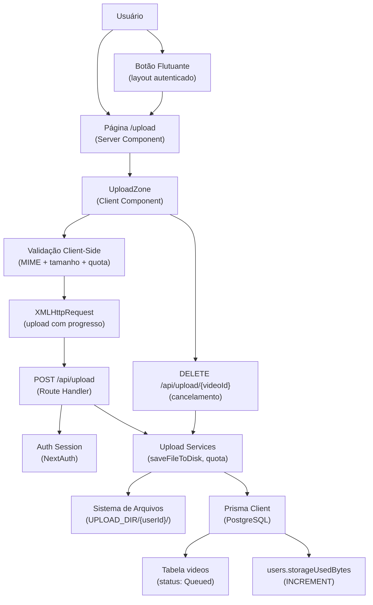

# Especificação Técnica: F02 - Upload de Vídeo

## 1. Visão Geral Técnica

**O quê:** Sistema de upload de arquivos de vídeo que permite ao usuário autenticado enviar vídeos (até 300 MB) via drag-and-drop ou seletor de arquivos, com feedback de progresso em tempo real (percentual, velocidade e tempo estimado), controle de quota de armazenamento (1 GB por usuário) e opção de cancelamento durante a transferência. Após o upload concluído, um registro `Video` é criado no banco com status `Queued`, sinalizando ao F03 o início do processamento em background.

**Por quê:** F02 é o ponto de entrada de todo o conteúdo do usuário. Ele precisa receber arquivos binários do navegador de forma confiável, persistí-los no sistema de arquivos local, aplicar as regras de validação de tipo MIME e tamanho no cliente (sem aguardar o servidor), impor a quota por usuário e produzir o contrato de dados (caminho do arquivo, nome original, MIME, tamanho, timestamp) que o F03 consome para transcrição e geração de thumbnail. Depende da infraestrutura de sessão (middleware, tabela `users`) provida pelo F01.

**Escopo:**
- **Incluído:** zona de drag-and-drop e fallback por seletor de arquivo; validação MIME e tamanho no cliente antes do início do upload; indicador de quota (`X MB usados de 1 GB`) antes da seleção; upload via XMLHttpRequest com eventos de progresso; exibição de nome do arquivo, percentual, velocidade (KB/s ou MB/s) e tempo estimado restante; botão "Cancelar" que aborta o XHR e remove o arquivo parcial no servidor; registro `Video` criado com status `Queued` ao concluir; toast "Upload concluído. Processamento iniciado."; botão flutuante de upload no layout autenticado; verificação de quota no cliente antes de iniciar
- **Excluído:** uploads múltiplos simultâneos; upload chunked/retomável; validação do conteúdo do arquivo de vídeo pelo servidor (responsabilidade do F03); transcrição, geração de thumbnail e processamento em background (F03); UI completa da biblioteca (F04)

---

## 2. Impacto na Arquitetura

**Componentes afetados:**

**Frontend:**

| Caminho do Arquivo | Status | Propósito | Responsabilidades Principais |
|--------------------|--------|-----------|------------------------------|
| `src/app/(app)/upload/page.tsx` | Novo | Página de upload | Server Component; busca quota inicial via `getQuota()`; compõe `QuotaIndicator` e `UploadZone` |
| `src/components/upload/UploadZone.tsx` | Novo | Zona de drag-and-drop | Gerencia eventos de drag; abre file picker; valida MIME (`video/*`) e tamanho (≤300 MB) no cliente; coordena XMLHttpRequest; expõe callbacks `onProgress`, `onComplete`, `onError`, `onCancel` |
| `src/components/upload/ProgressBar.tsx` | Novo | Barra de progresso | Exibe nome do arquivo, percentual, velocidade (KB/s ou MB/s) e tempo estimado; botão Cancelar |
| `src/components/upload/QuotaIndicator.tsx` | Novo | Indicador de quota | Exibe "X MB usados de 1 GB" com barra de preenchimento visual; aceita `usedBytes` e `maxBytes` como props |
| `src/app/(app)/layout.tsx` | Modificado | Layout autenticado | Adiciona `<Link href="/upload">` estilizado como botão flutuante fixo no canto inferior direito |

**Backend:**

| Caminho do Arquivo | Status | Propósito | Responsabilidades Principais |
|--------------------|--------|-----------|------------------------------|
| `src/app/api/upload/route.ts` | Novo | Handler POST de upload | Valida sessão; extrai `file` do `FormData`; aplica validações de MIME e tamanho no servidor; verifica quota; grava arquivo em disco; cria registro `Video`; incrementa `storageUsedBytes` |
| `src/app/api/upload/[videoId]/route.ts` | Novo | Handler DELETE de cancelamento | Valida sessão e ownership; remove arquivo do disco; exclui registro `Video`; decrementa `storageUsedBytes` se já somado |
| `src/server/upload/services.ts` | Novo | Serviços de upload | `saveFileToDisk()`, `deleteFileFromDisk()`, `generateStoredFilename()`, `incrementQuota()`, `decrementQuota()` |
| `src/server/upload/actions.ts` | Novo | Server Action de quota | `getQuota()` — autenticado; lê `storageUsedBytes` do usuário; retorna `{ usedBytes, maxBytes }` |
| `src/lib/storage.ts` | Novo | Abstração de armazenamento | `getUploadDir(userId)` → caminho absoluto baseado em `UPLOAD_DIR`; cria diretório do usuário se não existir |

**Database:**

| Arquivo de Migração | Tabelas Afetadas | Operação | Notas |
|--------------------|-----------------|----------|-------|
| `prisma/migrations/002_video_upload/migration.sql` | `videos` (CREATE), `users` (ALTER) | CREATE TABLE + ALTER COLUMN | Cria tabela `videos` com enum `VideoStatus`; adiciona `storageUsedBytes BIGINT DEFAULT 0` em `users` |



---

## 3. Decisões Técnicas

| Decisão | Abordagem Escolhida | Alternativa Considerada | Trade-off |
|---------|---------------------|------------------------|-----------|
| Protocolo de progresso | XMLHttpRequest com `onprogress` | `fetch` + `ReadableStream` | XHR tem suporte nativo e uniforme a eventos de progresso de upload em todos os navegadores-alvo; `fetch` com progresso exige `duplex: 'half'` com suporte ainda inconsistente |
| Armazenamento de arquivos | Filesystem local (`UPLOAD_DIR/{userId}/{uuid}.ext`) | MinIO / S3 / objeto em banco | PRD exige execução local sem dependências externas; a abstração em `src/lib/storage.ts` permite substituição futura sem alterar os serviços |
| Rastreamento de quota | Coluna desnormalizada `storageUsedBytes` no User com operações atômicas | `SUM(fileSizeBytes)` por query em tempo real | Evita aggregation custosa a cada request; consistência garantida por `$executeRaw` com `INCREMENT`/`DECREMENT` atômico; planejado no spec do F01 |
| Cancelamento | Abort XHR no cliente + `DELETE /api/upload/[videoId]` no servidor | Apenas abort no cliente | Arquivos parciais são gravados progressivamente no disco via streaming; sem endpoint de limpeza, espaço e registro ficariam órfãos |
| Status do Video | Prisma enum `VideoStatus` (Queued, Processing, Ready, Failed) | String com validação em runtime | Segurança de tipos end-to-end no TypeScript; previne valores inválidos no banco; consumido identicamente por F03, F04 e F06 |
| Limite de body da route | `export const maxDuration = 60` + `request.formData()` nativo | Middleware customizado de streaming | Route Handler do App Router processa multipart nativamente; `maxDuration` garante timeout adequado para arquivos maiores em redes lentas de desenvolvimento |

---

## 4. Visão Geral dos Componentes

**Frontend:**

| Caminho do Arquivo | Status | Propósito | Responsabilidades Principais |
|--------------------|--------|-----------|------------------------------|
| `src/app/(app)/upload/page.tsx` | Novo | Página de upload | Busca quota inicial via `getQuota()` no servidor; passa `usedBytes` e `maxBytes` para `QuotaIndicator` e `UploadZone`; exibe toast e redireciona para `/library` após conclusão |
| `src/components/upload/UploadZone.tsx` | Novo | Zona de drag-and-drop | Gerencia estados `idle`, `dragover`, `uploading`, `done`, `error`; valida MIME e tamanho; cria e controla XHR; calcula velocidade e ETA a partir dos eventos `onprogress`; chama `DELETE /api/upload/[videoId]` ao cancelar |
| `src/components/upload/ProgressBar.tsx` | Novo | Barra de progresso | Recebe `filename`, `percentage`, `speedBps` e `etaSeconds`; formata velocidade legível (KB/s ou MB/s); exibe botão Cancelar que dispara prop `onCancel` |
| `src/components/upload/QuotaIndicator.tsx` | Novo | Indicador de quota | Exibe bytes usados em formato legível; barra de preenchimento proporcional; aviso visual quando quota > 90% |
| `src/app/(app)/layout.tsx` | Modificado | Layout autenticado | Adiciona botão flutuante `<Link href="/upload">` com ícone de upload fixo no canto inferior direito; visível em todas as páginas autenticadas |

**Backend:**

| Caminho do Arquivo | Status | Propósito | Responsabilidades Principais |
|--------------------|--------|-----------|------------------------------|
| `src/app/api/upload/route.ts` | Novo | Handler POST de upload | Verifica sessão via `auth()`; extrai e valida o `file` do FormData; verifica quota disponível; chama `saveFileToDisk()`; cria registro `Video` com `status: 'Queued'`; chama `incrementQuota()`; retorna `{ videoId, originalFilename, fileSizeBytes, uploadedAt }` |
| `src/app/api/upload/[videoId]/route.ts` | Novo | Handler DELETE de cancelamento | Verifica sessão; busca o Video por `videoId`; valida que `video.userId === session.user.id`; chama `deleteFileFromDisk()` e `decrementQuota()`; exclui o registro do banco |
| `src/server/upload/services.ts` | Novo | Lógica de negócio | `saveFileToDisk(userId, file)` → `storedPath`; `deleteFileFromDisk(filePath)` — silencioso se arquivo ausente; `generateStoredFilename(mimeType)` → `${uuid}.${ext}`; `incrementQuota(userId, bytes)`; `decrementQuota(userId, bytes)` — não reduz abaixo de zero |
| `src/server/upload/actions.ts` | Novo | Server Action de quota | `getQuota()` — chama `auth()`, lê `User.storageUsedBytes`, retorna `{ usedBytes: number; maxBytes: number }` |
| `src/lib/storage.ts` | Novo | Abstração de storage local | `getUploadDir(userId)` — resolve `path.join(process.env.UPLOAD_DIR, userId)` e cria o diretório com `fs.mkdirSync({ recursive: true })` se necessário |

**Database:**

| Arquivo de Migração | Tabelas Afetadas | Operação | Notas |
|--------------------|-----------------|----------|-------|
| `prisma/migrations/002_video_upload/migration.sql` | `videos`, `users` | CREATE TABLE + ALTER COLUMN | Gerado via `prisma migrate dev --name video_upload` |

---

## 5. Contratos de API

### Upload de Arquivo de Vídeo

- **Método:** POST
- **Caminho:** `/api/upload`
- **Autenticação:** Sessão NextAuth (cookie HTTP-only)
- **Content-Type:** `multipart/form-data`
- **Configuração:** `export const maxDuration = 60` no route handler

**Request:**

| Campo | Tipo | Obrigatório | Validação | Descrição |
|-------|------|-------------|-----------|-----------|
| `file` | `File` (multipart) | Sim | MIME `video/*`; tamanho ≤ 314.572.800 bytes (300 MB) | Arquivo de vídeo a ser enviado |

**Request Example (multipart form-data):**
```
POST /api/upload
Content-Type: multipart/form-data; boundary=----FormBoundary

------FormBoundary
Content-Disposition: form-data; name="file"; filename="aula.mp4"
Content-Type: video/mp4

[binary data]
------FormBoundary--
```

**Response (Sucesso — 201):**

| Campo | Tipo | Descrição |
|-------|------|-----------|
| `videoId` | `string` | ID do registro Video criado (cuid) |
| `originalFilename` | `string` | Nome original do arquivo |
| `fileSizeBytes` | `number` | Tamanho em bytes |
| `uploadedAt` | `string` | ISO 8601 timestamp |

**Response Example:**
```json
{
  "videoId": "clx1234567890abcdef",
  "originalFilename": "aula.mp4",
  "fileSizeBytes": 52428800,
  "uploadedAt": "2026-07-15T14:30:00.000Z"
}
```

**Error Codes:**

| Código | HTTP Status | Descrição |
|--------|-------------|-----------|
| `UNAUTHORIZED` | 401 | Sessão ausente ou expirada |
| `FILE_TOO_LARGE` | 400 | Arquivo excede 300 MB |
| `INVALID_MIME` | 400 | MIME type não começa com `video/` |
| `QUOTA_EXCEEDED` | 400 | Upload ultrapassaria o limite de 1 GB do usuário |
| `UPLOAD_FAILED` | 500 | Falha ao gravar arquivo em disco |

**Error Response Example:**
```json
{
  "error": "QUOTA_EXCEEDED",
  "remainingBytes": 52428800
}
```

---

### Cancelamento de Upload

- **Método:** DELETE
- **Caminho:** `/api/upload/[videoId]`
- **Autenticação:** Sessão NextAuth (cookie HTTP-only)

**Request:** Sem body.

**Response (Sucesso — 200):**
```json
{ "success": true }
```

**Error Codes:**

| Código | HTTP Status | Descrição |
|--------|-------------|-----------|
| `UNAUTHORIZED` | 401 | Sessão ausente ou expirada |
| `NOT_FOUND` | 404 | `videoId` não encontrado no banco |
| `FORBIDDEN` | 403 | Video pertence a outro usuário |

---

### Consulta de Quota (Server Action)

- **Função:** `getQuota()` em `src/server/upload/actions.ts`
- **Autenticação:** Sessão NextAuth (server-side via `auth()`)

**Response (Sucesso):**
```json
{
  "usedBytes": 524288000,
  "maxBytes": 1073741824
}
```

---

## 6. Modelo de Dados

**Enum: `VideoStatus`**

| Valor | Descrição |
|-------|-----------|
| `Queued` | Upload concluído; aguardando processamento pelo F03 |
| `Processing` | F03 está processando o vídeo |
| `Ready` | Transcrição e thumbnail disponíveis |
| `Failed` | Processamento falhou; `failureReason` preenchido |

---

**Tabela: `videos`** (nova)

| Coluna | Tipo | Nullable | Default | Descrição |
|--------|------|----------|---------|-----------|
| `id` | `TEXT` | Não | `cuid()` | Chave primária |
| `userId` | `TEXT` | Não | — | FK → users.id (CASCADE DELETE) |
| `originalFilename` | `TEXT` | Não | — | Nome original do arquivo enviado pelo usuário |
| `storedFilename` | `TEXT` | Não | — | Nome gerado no servidor (`${uuid}.${ext}`); único |
| `filePath` | `TEXT` | Não | — | Caminho absoluto no filesystem |
| `mimeType` | `TEXT` | Não | — | MIME type detectado pelo servidor |
| `fileSizeBytes` | `BIGINT` | Não | — | Tamanho do arquivo em bytes |
| `status` | `VideoStatus` | Não | `Queued` | Status de processamento |
| `failureReason` | `TEXT` | Sim | `NULL` | Motivo do erro de processamento (F03) |
| `uploadedAt` | `TIMESTAMPTZ` | Não | `NOW()` | Timestamp de conclusão do upload |
| `createdAt` | `TIMESTAMPTZ` | Não | `NOW()` | Criação do registro |
| `updatedAt` | `TIMESTAMPTZ` | Não | `NOW()` | Última atualização |

**Indexes:**

| Nome do Índice | Colunas | Tipo | Propósito |
|----------------|---------|------|-----------|
| `videos_userId_uploadedAt_idx` | `userId, uploadedAt DESC` | btree | Listagem da biblioteca ordenada por data (F04) |
| `videos_userId_status_idx` | `userId, status` | btree | Filtro por status na biblioteca (F04) |
| `videos_storedFilename_key` | `storedFilename` | UNIQUE | Previne colisões de nome no filesystem |

**Constraints:**

| Constraint | Tipo | Definição | Propósito |
|------------|------|-----------|-----------|
| `videos_pkey` | PRIMARY KEY | `id` | Identificador único |
| `videos_userId_fkey` | FOREIGN KEY | `userId REFERENCES users(id) ON DELETE CASCADE` | Remove vídeos ao excluir usuário |

---

**Tabela: `users`** (alterada)

| Coluna Adicionada | Tipo | Nullable | Default | Descrição |
|-------------------|------|----------|---------|-----------|
| `storageUsedBytes` | `BIGINT` | Não | `0` | Bytes de quota consumidos; atualizado atomicamente em cada upload/delete |

---

**Migration:**

```sql
-- CreateEnum
CREATE TYPE "VideoStatus" AS ENUM ('Queued', 'Processing', 'Ready', 'Failed');

-- AlterTable users: adiciona storageUsedBytes
ALTER TABLE "users" ADD COLUMN "storageUsedBytes" BIGINT NOT NULL DEFAULT 0;

-- CreateTable videos
CREATE TABLE "videos" (
    "id"               TEXT           NOT NULL,
    "userId"           TEXT           NOT NULL,
    "originalFilename" TEXT           NOT NULL,
    "storedFilename"   TEXT           NOT NULL,
    "filePath"         TEXT           NOT NULL,
    "mimeType"         TEXT           NOT NULL,
    "fileSizeBytes"    BIGINT         NOT NULL,
    "status"           "VideoStatus"  NOT NULL DEFAULT 'Queued',
    "failureReason"    TEXT,
    "uploadedAt"       TIMESTAMPTZ    NOT NULL DEFAULT CURRENT_TIMESTAMP,
    "createdAt"        TIMESTAMPTZ    NOT NULL DEFAULT CURRENT_TIMESTAMP,
    "updatedAt"        TIMESTAMPTZ    NOT NULL,
    CONSTRAINT "videos_pkey" PRIMARY KEY ("id")
);

CREATE UNIQUE INDEX "videos_storedFilename_key"   ON "videos"("storedFilename");
CREATE INDEX        "videos_userId_uploadedAt_idx" ON "videos"("userId", "uploadedAt" DESC);
CREATE INDEX        "videos_userId_status_idx"     ON "videos"("userId", "status");

ALTER TABLE "videos"
    ADD CONSTRAINT "videos_userId_fkey"
    FOREIGN KEY ("userId") REFERENCES "users"("id")
    ON DELETE CASCADE ON UPDATE CASCADE;
```

---

## 7. Estratégia de Testes

**Estrutura de arquivos de teste:**

| Arquivo de Teste | Tipo | Alvo | Meta de Cobertura |
|-----------------|------|------|------------------|
| `src/server/upload/__tests__/services.test.ts` | Unitário | `services.ts` | 90% |
| `src/server/upload/__tests__/actions.test.ts` | Unitário | `actions.ts` | 85% |
| `src/components/upload/__tests__/UploadZone.test.tsx` | Componente | `UploadZone.tsx` | 80% |
| `src/components/upload/__tests__/ProgressBar.test.tsx` | Componente | `ProgressBar.tsx` | 80% |
| `e2e/upload.spec.ts` | E2E (Playwright) | Fluxos completos | Critérios de aceitação F02 |

**Funções de teste — services.test.ts:**

| Função de Teste | Descrição | Asserções |
|----------------|-----------|-----------|
| `saveFileToDisk_createsFileInUserDir` | Arquivo gravado no diretório correto do usuário | Arquivo existe no caminho retornado |
| `saveFileToDisk_createsDirectoryIfAbsent` | Diretório do usuário não existe antes da chamada | Diretório e arquivo criados sem erro |
| `deleteFileFromDisk_removesFile` | Arquivo existente no caminho informado | Arquivo não existe após a chamada |
| `deleteFileFromDisk_silentOnMissingFile` | Arquivo já removido antes da chamada | Nenhuma exceção lançada |
| `generateStoredFilename_returnsUUIDWithExtension` | MIME `video/mp4` fornecido | Retorna string com padrão `[uuid].mp4` |
| `incrementQuota_updatesUser` | Usuário com 100 MB, incremento de 50 MB | `storageUsedBytes = 150 MB` após chamada |
| `decrementQuota_updatesUser` | Usuário com 100 MB, decremento de 50 MB | `storageUsedBytes = 50 MB` após chamada |
| `decrementQuota_doesNotGoNegative` | Decremento maior que o valor atual | `storageUsedBytes = 0` (não vai negativo) |

**Funções de teste — actions.test.ts:**

| Função de Teste | Descrição | Asserções |
|----------------|-----------|-----------|
| `getQuota_returnsUsedAndMax` | Usuário autenticado com 500 MB usados | Retorna `{ usedBytes: 524288000, maxBytes: 1073741824 }` |
| `getQuota_unauthenticated` | `auth()` retorna `null` | Lança erro de autenticação |

**Funções de teste — UploadZone.test.tsx:**

| Função de Teste | Descrição | Asserções |
|----------------|-----------|-----------|
| `renders_dropZone_idle` | Componente renderizado sem arquivo | Texto de instrução visível; barra de progresso ausente |
| `rejectsFile_oversized` | Arquivo de 301 MB selecionado via input | Mensagem de erro "300 MB" visível; `onError` chamado; XHR não iniciado |
| `rejectsFile_invalidMime` | Arquivo `image/png` selecionado | Mensagem de MIME inválido visível; `onError` chamado |
| `rejectsFile_quotaExceeded` | `usedBytes + fileSize > maxBytes` | Mensagem de quota visível com espaço disponível; XHR não iniciado |
| `acceptsFile_validVideo` | Arquivo `video/mp4` de 50 MB dentro da quota | `ProgressBar` renderizada; XHR iniciado |
| `showsProgressBar_duringUpload` | `onprogress` disparado com `loaded=50%, total=100%` | Percentual "50%" visível na UI |
| `cancelButton_abortsXhrAndCallsEndpoint` | Botão Cancelar clicado com `videoId` disponível | `xhr.abort()` chamado; DELETE para `/api/upload/[videoId]` disparado; `onCancel` chamado |

**Funções de teste — e2e/upload.spec.ts (Playwright):**

| Função de Teste | Descrição | Critério de Aceitação |
|----------------|-----------|----------------------|
| `upload_via_drag_and_drop` | Arrastar arquivo de vídeo válido para a zona de drop | F02-AC01 |
| `upload_via_file_picker` | Clicar em "Escolher arquivo" e selecionar vídeo pelo seletor do OS | F02-AC02 |
| `reject_file_exceeds_300mb` | Selecionar arquivo de 301 MB; verificar que upload não é iniciado | F02-AC03 |
| `reject_non_video_mime` | Selecionar arquivo `.png`; verificar mensagem de MIME inválido | F02-AC04 |
| `shows_realtime_progress` | Upload em andamento exibe nome, %, velocidade e ETA simultaneamente | F02-AC05 |
| `cancel_upload_removes_partial_file` | Cancelar upload em andamento; verificar que arquivo não existe no disco e quota não mudou | F02-AC06 |
| `video_card_appears_with_queued_status` | Upload concluído; navegar para /library; card com badge "Queued" visível em ≤ 5 segundos | F02-AC07 |
| `quota_exceeded_blocks_upload` | Usuário com quota quase cheia tenta enviar arquivo que excederia o limite | F02-AC08 |
| `quota_indicator_displays_current_usage` | Página /upload carregada; indicador exibe bytes usados reais do banco | F02-AC08 (informativo) |

---

## Suposições e Decisões (Auto-Accept)

| Decisão | Valor Aplicado | Motivo |
|---------|---------------|--------|
| Protocolo de progresso | XMLHttpRequest com `onprogress` | Suporte uniforme entre navegadores sem libs externas; padrão para progresso de upload |
| Armazenamento | Filesystem local com `UPLOAD_DIR` configurável via env var | PRD exige execução local sem dependências externas de cloud |
| Limite de quota | 1 GB = 1.073.741.824 bytes | Definido explicitamente no PRD Seção 6 |
| Limite por arquivo | 300 MB = 314.572.800 bytes | Definido explicitamente no PRD Seção 6 |
| Quota: estratégia | Coluna desnormalizada `storageUsedBytes` em `users` | Planejada no spec do F01 (seção de Suposições); evita aggregation custosa |
| Status inicial do Video | `Queued` | PRD Seção 6 F02: "video card appears in the library with status 'Queued'" |
| Enum `VideoStatus` | Prisma enum nativo | Segurança de tipos end-to-end; consumido por F03, F04 e F06 |
| Estrutura de diretórios | `{UPLOAD_DIR}/{userId}/{uuid}.{ext}` | Isolamento por usuário; nomes únicos para prevenir colisões |
| `maxDuration` da route | 60 segundos | Adequado para desenvolvimento local; arquivos de 300 MB em 10 Mbps ≈ 240 s (testes usarão arquivos menores) |
| Cancelamento: limpeza | Endpoint DELETE + `deleteFileFromDisk()` | Arquivo parcial é gravado progressivamente; sem limpeza, gera arquivos órfãos e quota inconsistente |
