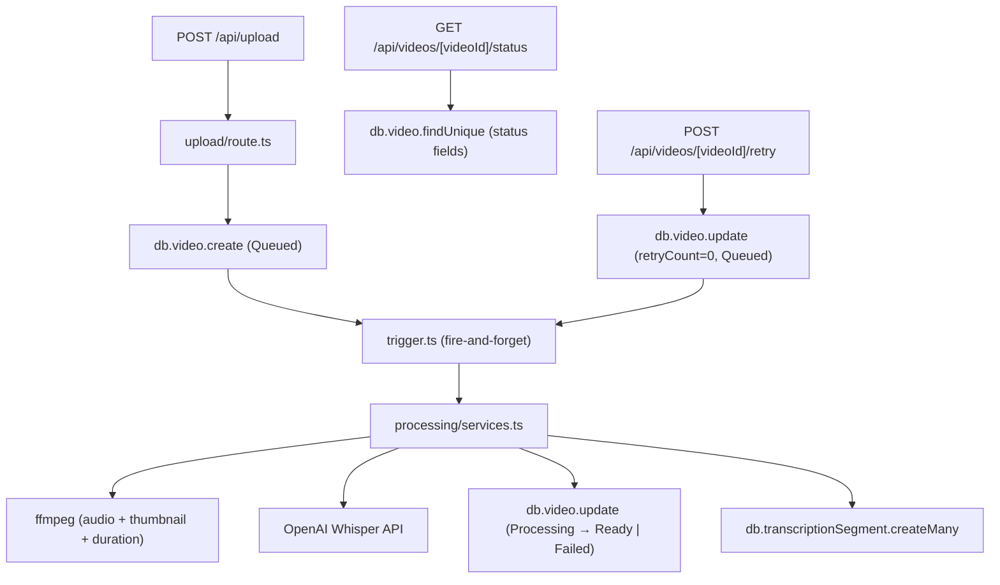

# F03 — Background Processing: Technical Specification

## 1. Technical Overview

### What
An asynchronous processing pipeline triggered after every video upload: extracts audio and duration via ffmpeg, runs speech-to-text via the OpenAI Whisper API, generates a thumbnail, persists timestamped transcription segments, updates video metadata, indexes full-text content on PostgreSQL, and manages status transitions with up to 3 automatic retries.

### Why
The upload API (F02) returns a synchronous 201 immediately after saving the file to disk. Heavy processing — audio extraction, transcription, thumbnail generation — cannot block the HTTP response. The pipeline must run in the background, write status to the database, and expose a polling endpoint so the UI can reflect transitions without page reloads.

### Scope — Included
- Fire-and-forget async trigger called from the upload route after `db.video.create`
- ffmpeg: audio extraction, duration via ffprobe, thumbnail capture at 5-second mark
- OpenAI Whisper API: speech-to-text + language auto-detection (PT / EN / ES)
- `TranscriptionSegment` table: one row per segment with startMs, endMs, text, order
- `Video` model additions: durationSeconds, thumbnailPath, language, retryCount, processingStartedAt, transcriptionText (full concatenated text for FTS)
- PostgreSQL GIN index on `transcriptionText` for full-text search (consumed by F08)
- Status lifecycle: `Queued` → `Processing` → `Ready` | `Failed`
- Automatic retries on transient error, up to 3 attempts; `retryCount` tracked in DB
- Polling endpoint: `GET /api/videos/[videoId]/status`
- Manual retry endpoint: `POST /api/videos/[videoId]/retry`

### Scope — Deferred
- FIFO processing queue ordering across users (Full Scope addition)
- Dedicated worker process / external job queue (BullMQ, pg-boss)

---

## 2. Architecture Impact

### Affected Components



---

## 3. Technical Decisions

| Decision | Chosen Approach | Alternative Considered | Trade-off |
|---|---|---|---|
| Job execution | Fire-and-forget async call in Node.js process | BullMQ / pg-boss / separate worker | Zero new infrastructure for local dev; pending jobs lost on process crash — acceptable since manual retry is available |
| Transcription | OpenAI Whisper API via `openai` npm package | Local Whisper via `@xenova/transformers` | Requires `OPENAI_API_KEY`; simpler integration; local alternative avoids API cost but needs significant CPU/GPU time |
| Audio/thumbnail/duration | `fluent-ffmpeg` + `@ffmpeg-installer/ffmpeg` + `@ffprobe-installer/ffprobe` | Native ffmpeg shell exec | Self-contained; no system-level ffmpeg dependency required |
| Full-text index | `Video.transcriptionText` (TEXT) + PostgreSQL GIN tsvector index via raw migration | External search service (Meilisearch) | Native PostgreSQL; no new services; consumed by F08 via `$queryRaw` |
| Retry mechanism | `retryCount` DB field; pipeline re-runs in the same process | External retry queue | Consistent with no-queue approach; simpler; retry count survives restarts since it is persisted |
| Scope | Core + automatic retry (Full Scope retry included) | Core only | PRD Section 9 ACs explicitly test retry behavior; Core-only would leave ACs unverifiable |

---

## 4. Component Overview

### Backend

| File Path | New/Modified | Purpose | Key Responsibilities |
|---|---|---|---|
| `prisma/schema.prisma` | Modified | Schema | Add processing fields to Video; add TranscriptionSegment model |
| `prisma/migrations/YYYYMMDD_f03_processing/migration.sql` | New | Migration | ALTER TABLE videos; CREATE TABLE transcription_segments; CREATE GIN index |
| `src/server/processing/services.ts` | New | Pipeline logic | `runProcessingJob`, `extractAudioAndMeta`, `generateThumbnail`, `transcribeAudio`, `saveSegments`, `indexFullText`, `updateVideoStatus` |
| `src/server/processing/trigger.ts` | New | Job launcher | `triggerProcessing(videoId)`: fire-and-forget entry point; catches all errors; logs to console |
| `src/app/api/videos/[videoId]/status/route.ts` | New | Status polling | GET — returns id, status, failureReason, thumbnailPath, durationSeconds, language |
| `src/app/api/videos/[videoId]/retry/route.ts` | New | Manual retry | POST — verifies Failed status, resets retryCount, sets Queued, calls triggerProcessing |
| `src/app/api/upload/route.ts` | Modified | Upload route | Call `triggerProcessing(video.id)` after successful `db.video.create` |
| `src/server/processing/__tests__/services.test.ts` | New | Unit tests | Mock ffmpeg, openai, db; test pipeline steps and retry logic |
| `e2e/processing.spec.ts` | New | E2E tests | Full pipeline via upload → status poll; retry flow |

### Database

| Migration | Tables Affected | Operation | Notes |
|---|---|---|---|
| `YYYYMMDD_f03_processing` | `videos` | ALTER TABLE | Add 6 new nullable/defaulted columns |
| `YYYYMMDD_f03_processing` | `transcription_segments` | CREATE TABLE | FK → videos.id CASCADE |
| `YYYYMMDD_f03_processing` | `videos` | CREATE INDEX | GIN index on `to_tsvector('simple', transcriptionText)` |

---

## 5. API Contracts

### GET /api/videos/[videoId]/status
- **Authentication:** Session required (`auth()`)
- **Authorization:** `video.userId === session.user.id`

**Response (200 — any status):**
```json
{
  "id": "clx4abc123",
  "status": "Processing",
  "failureReason": null,
  "thumbnailPath": null,
  "durationSeconds": null,
  "language": null
}
```

**Response (200 — Ready):**
```json
{
  "id": "clx4abc123",
  "status": "Ready",
  "failureReason": null,
  "thumbnailPath": "storage/thumbnails/user-1/clx4abc123.jpg",
  "durationSeconds": 342.5,
  "language": "pt"
}
```

**Error Codes:**
| Code | HTTP | Description |
|---|---|---|
| `UNAUTHORIZED` | 401 | No valid session |
| `NOT_FOUND` | 404 | Video does not exist |
| `FORBIDDEN` | 403 | Video belongs to another user |

---

### POST /api/videos/[videoId]/retry
- **Authentication:** Session required
- **Authorization:** `video.userId === session.user.id`
- **Precondition:** `video.status === "Failed"`

**Response (200):**
```json
{ "success": true }
```

**Error Codes:**
| Code | HTTP | Description |
|---|---|---|
| `UNAUTHORIZED` | 401 | No valid session |
| `NOT_FOUND` | 404 | Video does not exist |
| `FORBIDDEN` | 403 | Video belongs to another user |
| `CONFLICT` | 409 | Video is not in Failed status |

---

## 6. Data Model

### Video model additions (ALTER TABLE)

| Column | Prisma Type | Nullable | Default | Description |
|---|---|---|---|---|
| `durationSeconds` | `Float?` | Yes | NULL | Video duration in seconds (from ffprobe) |
| `thumbnailPath` | `String?` | Yes | NULL | Relative path to JPEG thumbnail |
| `language` | `String?` | Yes | NULL | Detected language code: pt / en / es |
| `retryCount` | `Int` | No | 0 | Number of automatic retries attempted |
| `processingStartedAt` | `DateTime?` | Yes | NULL | Timestamp when pipeline last started |
| `transcriptionText` | `String? @db.Text` | Yes | NULL | Full concatenated transcript for FTS (F08) |

**Prisma schema additions to Video model:**
```prisma
durationSeconds     Float?
thumbnailPath       String?
language            String?
retryCount          Int       @default(0)
processingStartedAt DateTime?
transcriptionText   String?   @db.Text

segments TranscriptionSegment[]
```

---

### Table: `transcription_segments`

| Column | Type | Nullable | Default | Description |
|---|---|---|---|---|
| `id` | `TEXT` (cuid) | No | cuid() | Primary key |
| `videoId` | `TEXT` | No | — | FK → videos.id (ON DELETE CASCADE) |
| `startMs` | `INTEGER` | No | — | Segment start in milliseconds |
| `endMs` | `INTEGER` | No | — | Segment end in milliseconds |
| `text` | `TEXT` | No | — | Segment transcription text |
| `order` | `INTEGER` | No | — | Display order (0-based) |

**Prisma model:**
```prisma
model TranscriptionSegment {
  id      String @id @default(cuid())
  videoId String
  startMs Int
  endMs   Int
  text    String @db.Text
  order   Int

  video Video @relation(fields: [videoId], references: [id], onDelete: Cascade)

  @@index([videoId, order])
  @@map("transcription_segments")
}
```

**Indexes:**
| Index | Columns | Type | Purpose |
|---|---|---|---|
| `transcription_segments_videoId_order` | `(videoId, order)` | btree | Ordered segment retrieval per video |
| `videos_transcription_fts` | `to_tsvector('simple', COALESCE("transcriptionText", ''))` | GIN | Full-text search by F08 |

**Migration SQL:**
```sql
-- Add processing columns to videos
ALTER TABLE "videos"
  ADD COLUMN "durationSeconds" DOUBLE PRECISION,
  ADD COLUMN "thumbnailPath" TEXT,
  ADD COLUMN "language" VARCHAR(5),
  ADD COLUMN "retryCount" INTEGER NOT NULL DEFAULT 0,
  ADD COLUMN "processingStartedAt" TIMESTAMPTZ,
  ADD COLUMN "transcriptionText" TEXT;

-- GIN index for full-text search (consumed by F08)
CREATE INDEX "videos_transcription_fts"
  ON "videos" USING GIN (to_tsvector('simple', COALESCE("transcriptionText", '')));

-- TranscriptionSegment table
CREATE TABLE "transcription_segments" (
  "id"      TEXT NOT NULL,
  "videoId" TEXT NOT NULL,
  "startMs" INTEGER NOT NULL,
  "endMs"   INTEGER NOT NULL,
  "text"    TEXT NOT NULL,
  "order"   INTEGER NOT NULL,
  CONSTRAINT "transcription_segments_pkey" PRIMARY KEY ("id"),
  CONSTRAINT "fk_segment_video"
    FOREIGN KEY ("videoId") REFERENCES "videos"("id") ON DELETE CASCADE
);

CREATE INDEX "transcription_segments_videoId_order"
  ON "transcription_segments"("videoId", "order");
```

---

## 7. Testing Strategy

### Test Files

| Test File | Type | Target | Coverage Goal |
|---|---|---|---|
| `src/server/processing/__tests__/services.test.ts` | Unit | `services.ts` | Pipeline steps, status transitions, retry logic |
| `e2e/processing.spec.ts` | E2E | Full pipeline via upload → status poll | Trigger, transitions, retry endpoint |

### Unit Tests (`services.test.ts`)

Mock strategy: `vi.mock('fluent-ffmpeg')`, `vi.mock('openai')`, `vi.mock('@/lib/db')`.

| Test Function | Description | Assertions |
|---|---|---|
| `runProcessingJob — success path` | All mocks succeed | status → Ready; segments createMany called; thumbnailPath, language, durationSeconds set on video |
| `runProcessingJob — sets Processing on start` | Check first db update | `db.video.update` called with `{ status: 'Processing', processingStartedAt: expect.any(Date) }` before any ffmpeg call |
| `runProcessingJob — fails on ffmpeg error` | ffmpeg throws | `db.video.update` called with `{ status: 'Failed', failureReason: expect.any(String) }` |
| `runProcessingJob — fails on Whisper error` | OpenAI call rejects | `db.video.update` called with `{ status: 'Failed', failureReason: expect.any(String) }` |
| `runProcessingJob — retries on transient error` | Throws once, then succeeds | retryCount incremented; final status → Ready |
| `runProcessingJob — exhausts retries` | Throws 3 times | `db.video.update` called with `{ status: 'Failed', retryCount: 3 }` |
| `saveSegments — creates all segments` | 3-segment array input | `db.transcriptionSegment.createMany` called with mapped data |
| `updateVideoStatus — writes correct fields` | Call with Ready payload | Prisma update receives all expected fields |

### E2E Tests (`e2e/processing.spec.ts`)

| Test | Description | Assertions |
|---|---|---|
| `upload triggers processing` | Upload sample-pt.mp4; poll GET /status | Status transitions from Queued to Processing within 5s; eventually reaches Ready |
| `retry resets failed video` | Seed a Failed video; POST /retry | Response 200 `{ success: true }`; GET /status returns Queued within 2s |
| `status returns language` | Upload sample-pt.mp4; await Ready | GET /status returns `language === "pt"` |
| `status endpoint enforces ownership` | GET /status with different user session | Returns 403 FORBIDDEN |
| `retry endpoint rejects non-failed video` | POST /retry on a Ready video | Returns 409 CONFLICT |

---

## Assumptions / Decisions (Auto-Accept)

- **Scope includes retry (Full Scope):** PRD Section 9 ACs explicitly test retry behavior; omitting it would leave multiple ACs unverifiable. Auto-Accept default is Core only, but this is overridden by AC coverage requirements.
- **Fire-and-forget vs. queue:** No queue library in project dependencies; local-execution philosophy matches simple async trigger. Manual retry covers lost jobs.
- **OpenAI Whisper:** Most straightforward transcription integration. `WHISPER_STUB=true` env var can enable a test stub to avoid API calls in CI.
- **@ffmpeg-installer/ffmpeg:** Avoids system-level ffmpeg requirement; consistent with self-contained local dev setup.
- **GIN index via raw migration:** Prisma does not support tsvector natively; raw SQL in migration is the established pattern for this project type.
- **`transcriptionText` on Video model:** Keeps full-text indexing simple; F08 will query it via `$queryRaw`. Concatenated from all segment texts after transcription completes.
- **Thumbnail stored at `THUMBNAIL_DIR/{userId}/{videoId}.jpg`:** Mirrors the upload storage pattern (`UPLOAD_DIR/{userId}/...`).
