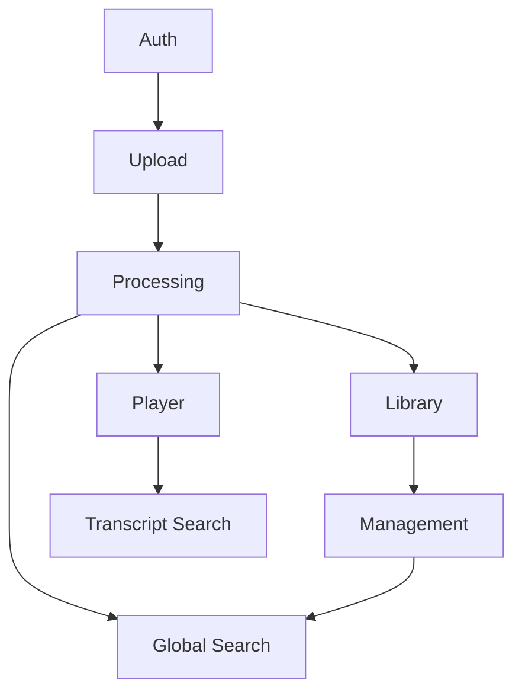

# VideoMax

## 1. Executive Summary

VideoMax is a personal video management platform that enables users to upload, organize, and watch their own video collection in a private, structured workspace. Designed for individual use, it provides each user with 1 GB of personal storage and supports all common video formats up to 300 MB per file.

The platform's central feature is interactive transcription: every video is automatically transcribed in Portuguese, English, or Spanish after upload, and the resulting text is synchronized with the video player. Users can click any line in the transcription panel to jump directly to that moment in the video, transforming any recording into a navigable document. Transcription content is fully indexed and searchable both within a specific video and across the entire library.

VideoMax is architected for easy local execution, making setup and testing straightforward without external cloud dependencies. The complete experience — from upload through transcription, playback, and search — runs in a single local environment, lowering the barrier to self-hosting and development iteration.

---

## 2. Problem and Opportunity

**The Problem**

- **Finding moments in long videos is slow**: Locating a specific topic in a one-hour lecture or recorded meeting requires manual scrubbing, with no textual reference to guide the search.
- **Personal video collections lack structure**: Videos stored in folders have no searchable metadata, making retrieval dependent on remembering file names or upload dates.
- **Transcription is a manual effort**: Creating accurate, time-synced transcripts requires specialized tools or professional services not built into standard video platforms.
- **Fragmented toolchain**: Users rely on separate applications for storage, playback, organization, and transcription, with no unified workflow.

**The Opportunity**

VideoMax eliminates each pain point with a single integrated platform:
- Clickable transcription replaces scrubbing — the user reads to find the moment, then clicks to play from there.
- Predefined categories, tags, and full-text search replace folder-based organization, enabling retrieval by topic, label, or transcript content.
- Automatic speech-to-text after every upload removes the manual transcription step entirely.
- A unified interface for upload, management, playback, and search eliminates context switching between tools.

---

## 3. Target Audience

### Primary Users

**Personal Content Curator**
- Records or downloads lectures, webinars, tutorials, meetings, or personal content for private review
- Needs to locate specific moments in hours of footage without rewatching entire videos
- Relies on search, categories, and tags to navigate a growing collection of dozens to hundreds of videos

---

## 4. Objectives

**Product Objectives**

1. **Enable** retrieval of any video moment in under 30 seconds via clickable transcription
2. **Automate** transcription generation for all uploaded videos within 2× the video's duration
3. **Provide** a structured library with category, tag, and full-text search filtering
4. **Guarantee** a reliable upload experience for files up to 300 MB within the 1 GB user quota
5. **Deliver** a responsive player with speed, quality, and fullscreen controls loading in under 3 seconds

**Success Metrics**

1. Users locate and play a target video moment in < 30 seconds via transcript click in usability testing (target: 90% success rate)
2. 95% of videos have completed transcription within 2× their duration from the moment upload finishes
3. User can filter or search the library and open a video in ≤ 5 interactions
4. Upload success rate ≥ 98% for files ≤ 300 MB on standard home broadband (> 10 Mbps)
5. Video player begins playback within 3 seconds of the user opening the video detail page

---

## 5. User Stories

### F01. Authentication System
- As a user, I want to register with email and password so that I can create my personal account
- As a user, I want to log in with email and password so that I can access my video library
- As a user, I want to log in with Google or GitHub so that I can authenticate without creating a separate password
- As a user, I want to reset my password via email link so that I can recover access if I forget my credentials
- As a user, I want to log out so that I can secure my account on shared devices

### F02. Video Upload
- As a user, I want to drag a video file into a drop zone so that the upload starts without clicking a button
- As a user, I want to select a file via file picker so that I can upload without using drag-and-drop
- As a user, I want to see real-time progress showing filename, percentage, and speed so that I know when the upload will finish
- As a user, I want to be notified immediately if a file exceeds 300 MB so that I do not wait for a failed upload
- As a user, I want to see my remaining storage quota before uploading so that I know if I have space available
- As a user, I want to cancel an in-progress upload so that I can stop it if I selected the wrong file

### F03. Background Processing
- As the system, I want to start transcription automatically after upload completes so that no user action is required
- As the system, I want to detect the video's spoken language automatically so that the correct transcription model is applied
- As the system, I want to generate timestamped transcription segments so that the player can sync text to video playback position
- As the system, I want to generate a video thumbnail so that the library displays a visual preview
- As a user, I want to see the processing status (Queued, Processing, Ready, Failed) so that I know when my video will be available
- As the system, I want to retry processing automatically on transient failure so that temporary errors do not require user intervention

### F04. Video Library
- As a user, I want to see all my videos in a grid with thumbnails so that I can visually browse my collection
- As a user, I want to switch to a list view so that I can see more information per video in a compact layout
- As a user, I want to filter my library by category so that I can see only videos from a specific topic
- As a user, I want to filter by tag so that I can narrow down my collection to labeled videos
- As a user, I want to filter by processing status so that I can identify videos that failed transcription
- As a user, I want to filter by upload date range so that I can find recently added videos
- As a user, I want to click a video to open its detail page so that I can watch or manage it

### F05. Video Management
- As a user, I want to rename my video so that I can replace the original filename with a meaningful title
- As a user, I want to add a description to my video so that I can record notes or context
- As a user, I want to assign categories to my video so that I can organize it by topic
- As a user, I want to assign tags to my video so that I can label it for precise retrieval
- As a user, I want to archive a video so that it is hidden from my library without being permanently deleted
- As a user, I want to unarchive a video so that I can restore it to my main library
- As a user, I want to delete a video so that I can free up storage quota
- As a user, I want to confirm before deleting so that I do not accidentally lose a video

### F06. Video Player with Transcription Panel
- As a user, I want to play and pause my video so that I can control playback
- As a user, I want to seek to any point using the progress bar so that I can jump directly to a moment
- As a user, I want to adjust playback speed (0.5× to 2×) so that I can consume content faster or slower
- As a user, I want to enter fullscreen mode so that I can watch without distractions
- As a user, I want to download the original video file so that I can keep a local copy
- As a user, I want to see the transcription alongside the player so that I can read while watching
- As a user, I want the current transcription segment to be highlighted in real time so that I always know where I am in the text
- As a user, I want to click a transcription segment so that the video jumps to that exact moment

### F07. Transcription Search
- As a user, I want to search for words within the transcription of the current video so that I can find every moment where a topic is mentioned
- As a user, I want all matching segments highlighted simultaneously so that I can see the full distribution of occurrences
- As a user, I want to navigate between matches with next/previous buttons so that I can review each occurrence in order
- As a user, I want to click a highlighted match so that the video seeks to that segment's timestamp

### F08. Global Video Search
- As a user, I want to type a query in the top navigation bar and see matching videos so that I can find content without browsing the library
- As a user, I want results to include matches from title, description, transcription, category, and tag so that I do not need to remember exactly where the content is stored
- As a user, I want to see a snippet of the matching transcription text in the result so that I can confirm relevance before opening the video
- As a user, I want to click a transcription-based result so that the video opens at the matching moment

---

## 6. Functionalities

### F01. Authentication System

**Capabilities:**
- Email/password registration: minimum 8 characters, at least one number required
- Social login: Google OAuth 2.0 and GitHub OAuth 2.0
- Session: JWT stored in HTTP-only cookie, 7-day expiry, auto-renewed on each request
- Password reset: email link valid for 1 hour
- Login lockout: 15 minutes after 5 consecutive failed login attempts

**Experience:**
1. `/login` page: email/password form plus "Continue with Google" and "Continue with GitHub" buttons
2. Registration: fields are name, email, password; inline validation before submission
3. Social login: redirect to provider → callback to `/auth/callback` → redirect to `/library`
4. Password login success: redirect to `/library`; JWT stored in HTTP-only cookie
5. Password reset flow: user enters email → receives link within 60 seconds → sets new password → auto-login
6. Unauthenticated access to any protected route redirects to `/login`

**Error Handling:**
- Wrong credentials: "Email or password is incorrect." (identical message for both fields to prevent user enumeration)
- Lockout triggered: "Too many attempts. Try again in 15 minutes."
- Expired reset link: "This link has expired. Request a new password reset."
- Email already registered (on registration): "An account with this email already exists. Log in instead."
- Social login with new provider email: new account created automatically on first use

---

### F02. Video Upload

**Provides:**
- Uploaded video file path, original filename, MIME type, file size in bytes, upload timestamp (used by F03)

**Capabilities:**
- Accepted types: all MIME types beginning with `video/`
- Maximum file size: 300 MB per video
- Per-user storage quota: 1 GB total
- One file uploaded at a time
- Supports drag-and-drop and file picker

**Experience:**
1. Upload area visible on a dedicated `/upload` page and as a floating button on `/library`
2. Quota indicator shown before file selection: "X MB used of 1 GB"
3. File selection: drag file into drop zone or click "Choose File"
4. Instant client-side size validation before upload begins
5. Progress display: filename, percentage bar, upload speed (KB/s or MB/s), and estimated time remaining
6. "Cancel" button available during upload; clicking stops the transfer and removes the partial file
7. On completion: toast "Upload complete. Processing started." and video card appears in the library with status "Queued"

**Error Handling:**
- File > 300 MB: "File too large. Maximum allowed size is 300 MB."
- Quota exceeded: "Not enough storage. You have X MB remaining. Delete videos to free space."
- Non-video MIME type: "Only video files are accepted."
- Network interruption during upload: "Upload interrupted. Check your connection and try again."
- Server error: "Upload failed. Please try again in a few moments."

---

### F03. Background Processing

**Consumes:**
- F02: uploaded video file path, original filename, MIME type, file size in bytes

**Provides:**
- Processing status (used by F04)
- Video duration in seconds, thumbnail file path (used by F04, F08)
- Indexed full-text transcription (used by F08)
- Transcription segments with start timestamp (ms), end timestamp (ms), text, detected language, video file URL (used by F06)

**Core Scope:**
- Video validation, audio extraction, language auto-detection, speech-to-text transcription, thumbnail generation, status persistence, full-text indexing

**Full Scope additions:**
- Automatic retry up to 3 times on transient failure
- FIFO processing queue (most recent upload processed first within the user's queue)

**Capabilities:**
- Transcription SLA: completed within 2× video duration (e.g., a 10-minute video → transcript ready within 20 minutes)
- Supported languages: Portuguese (pt), English (en), Spanish (es) — auto-detected; defaults to Portuguese if detection is inconclusive
- Thumbnail: captured at the 5-second mark; falls back to first frame for videos shorter than 5 seconds
- Processing statuses: `Queued` → `Processing` → `Ready` | `Failed`
- Status reflected in the library card without page reload (polling every 10 seconds, or WebSocket if available)
- Failure reason stored and displayed on the video card

**Experience:**
1. Immediately after upload: video card shows status badge "Queued" with a spinner
2. When job starts: badge changes to "Processing" with an animated progress indicator
3. On completion: thumbnail appears on card, badge changes to "Ready", transcription available in the player
4. On failure: badge shows "Failed" with a brief reason and a "Retry" button
5. Clicking "Retry" re-queues the job; status resets to "Queued"

**Error Handling:**
- Audio extraction failure: status → Failed; message: "Could not extract audio from this file."
- Transcription timeout (> 2× video duration): status → Failed; message: "Transcription timed out."
- Retry exhausted after 3 attempts: status remains Failed; "Retry" button stays available for manual re-trigger
- Corrupt or unreadable file: status → Failed; message: "File is corrupted or cannot be read."
- Language undetectable: processing continues with Portuguese as default; no error shown to user

---

### F04. Video Library

**Consumes:**
- F03: processing status, video duration in seconds, thumbnail file path (per video)

**Capabilities:**
- Two display modes: Grid (4 columns desktop / 2 columns mobile) and List
- Filters: category (multi-select), tag (multi-select), processing status (single-select: Queued / Processing / Ready / Failed), upload date range (start date + end date picker)
- Default sort: newest upload first; secondary sort: alphabetical title
- Pagination: 20 videos per page; maximum 1,000 videos per user before archiving is required
- Archived videos excluded by default; accessible via "Show archived" toggle

**Experience:**
1. `/library` is the default destination after login
2. Toolbar: "Upload" button, view-mode toggle (grid icon / list icon), filter panel trigger, sort dropdown
3. Grid card shows: thumbnail, title (truncated at 2 lines), duration badge, up to 2 category chips, status badge
4. List row shows: small thumbnail, title, duration, up to 3 categories, up to 3 tags, status badge, upload date
5. Filter panel opens as a side drawer; active filters appear as removable chips below the toolbar; "Clear all" resets all filters
6. Empty state (no videos): "No videos yet. Upload your first video." with an upload call-to-action
7. Empty state (filters return nothing): "No videos match your filters." with a "Clear filters" link
8. Clicking a video opens `/video/:id` (video detail page with player and management panel)

---

### F05. Video Management

**Provides:**
- Video title, description, assigned category IDs, assigned tag IDs (used by F08)

**Capabilities:**
- Title: 3–120 characters, required, updated in-place
- Description: optional, maximum 500 characters, updated in-place
- Categories: predefined system list, multi-select, maximum 5 per video
- Tags: predefined system list, multi-select, maximum 10 per video
- Archive: soft-delete (reversible); hides video from main library view
- Delete: permanent; removes video file, transcription segments, thumbnail, and all metadata; frees the storage quota immediately

**Experience:**
1. Management panel appears in a sidebar alongside the player on `/video/:id`
2. Title field: editable text input; changes saved automatically on blur with a brief "Saved ✓" inline confirmation
3. Description: textarea with a live character counter; saved on blur
4. Category selector: searchable dropdown listing all predefined categories; selected items displayed as removable chips; maximum 5 enforced
5. Tag selector: searchable dropdown listing all predefined tags; selected items displayed as removable chips; maximum 10 enforced
6. "Archive" button: toggles archived state; label switches to "Unarchive" and an "Archived" visual badge appears on the library card
7. "Delete" button: opens a confirmation modal — "Delete this video? This action cannot be undone." with "Cancel" and "Delete" buttons
8. On confirmed delete: video removed, user redirected to `/library` with toast "Video deleted."

**Error Handling:**
- Title blank on blur: inline error "Title cannot be empty." — field reverts to the previous saved value
- Title exceeds 120 characters: inline error "Title must be 120 characters or fewer."
- Description exceeds 500 characters: character counter turns red; save is blocked
- Category or tag save failure: toast "Could not save changes. Please try again."
- Delete API failure: modal shows "Could not delete video. Please try again." — modal remains open

---

### F06. Video Player with Transcription Panel

**Consumes:**
- F03: transcription segments (start timestamp ms, end timestamp ms, text), detected language, video file URL

**Provides:**
- Transcription segments with text and timestamps, seek-to-timestamp interface (used by F07)

**Capabilities:**
- Video delivery: served via signed URL with 1-hour expiry; URL refreshed automatically before expiry
- Playback speeds: 0.5×, 0.75×, 1×, 1.25×, 1.5×, 2×
- Fullscreen: native browser Fullscreen API
- Download: direct download of the original video file via a secure link
- Transcription sync: active segment highlighted and panel auto-scrolled every 250 ms based on the player's `currentTime`
- Language badge: shows detected language code (PT, EN, ES) in the panel header

**Experience:**
1. `/video/:id` layout: player on the left (or top on mobile), transcription panel on the right (or below on mobile)
2. Player controls: play/pause, seek bar with elapsed/total time, volume slider, speed selector dropdown, fullscreen button, download button
3. Transcription panel header: language badge, total segment count, search icon (triggers F07 inline)
4. Each segment displays: timestamp in HH:MM:SS format followed by the segment text on the same line
5. Active segment: highlighted with a blue background; panel scrolls to keep it visible during playback
6. Clicking any segment: seeks the video to that segment's `startTimestamp`; segment is highlighted immediately
7. Panel when transcription unavailable (status Queued or Processing): "Transcription is being processed. It will appear here when ready."
8. Panel when processing Failed: "Transcription failed for this video." with a Retry button

---

### F07. Transcription Search

**Consumes:**
- F06: transcription segments (text, start timestamp ms), seek-to-timestamp interface

**Capabilities:**
- Scope: transcription of the currently open video only
- Minimum query length: 2 characters
- Matching: case-insensitive and accent-insensitive
- All matches highlighted simultaneously; no cap on result count
- Navigation: next/previous buttons cycle through occurrences in top-to-bottom order

**Experience:**
1. User clicks the search icon in the transcription panel header; a search input appears at the top of the panel
2. As the user types (debounced 300 ms): matching segments are highlighted in yellow; non-matching segments are dimmed to 40% opacity
3. Match counter shows "N of M matches" next to the input (e.g., "3 of 12 matches")
4. Next (▼) and previous (▲) buttons navigate between matches in order; panel scrolls to center each focused match
5. Clicking any highlighted match: video seeks to that segment's start timestamp
6. Pressing Escape or clearing the input via the × button: all highlights removed, full transcription restored at normal opacity
7. No matches: counter shows "0 matches"; all segments remain at full opacity

---

### F08. Global Video Search

**Consumes:**
- F03: indexed full-text transcription, video duration in seconds, thumbnail file path
- F05: video title, description, assigned category IDs, assigned tag IDs

**Capabilities:**
- Scope: all videos belonging to the authenticated user
- Indexed fields: title, description, full transcription text, category names, tag names
- Minimum query: 2 characters
- Quick results dropdown: up to 8 results shown on focus or as the user types
- Full results page: up to 20 results per page, ordered by relevance score
- Transcription snippet: up to 150 characters surrounding the match, with query terms bolded
- Clicking a transcription-based result: opens `/video/:id` with the matching segment highlighted and scrolled into view

**Experience:**
1. Search bar always visible in the top navigation bar on all authenticated pages
2. On focus or typing: a dropdown appears beneath the bar showing up to 8 quick results
3. Each quick result: small thumbnail, title, match type badge (Title / Transcription / Category / Tag), one-line snippet
4. Pressing Enter or clicking "See all results": navigates to `/search?q=...` with the full results page
5. Full results page: filter tabs (All / Title / Transcription / Category / Tag), 20 result cards per page with pagination
6. Result card: thumbnail, title, duration, category chips, match type badge, snippet with bolded matching terms
7. Clicking a transcription-based result: opens the video detail page with the matching segment highlighted in the panel and scrolled into view
8. No results: "No videos found for '[query]'. Try different keywords."

---

## 7. Out of Scope

**Collaboration and Sharing**
- Sharing videos with other users or generating public video links
- Comments, annotations, or reactions from other users

**Advanced AI Processing**
- AI-generated video summaries or chapter detection
- Speaker diarization (identifying who is speaking at each moment)
- Translation of transcriptions to languages other than the auto-detected one

**Video Editing**
- Trimming, cutting, merging, or re-encoding videos
- Manual caption or subtitle editing
- Watermarking or branding overlays

**Storage Plans and Monetization**
- Pay-per-use storage tiers (planned for a future version)
- In-app storage quota expansion
- Admin UI for managing predefined categories and tags (managed via database seed scripts in v1)

**Mobile and Desktop Applications**
- Native iOS, Android, Windows, or macOS applications (interface is mobile-responsive web only)

**External Integrations**
- Importing videos from YouTube, Google Drive, Dropbox, or other external services
- Exporting transcriptions to Notion, Google Docs, or other productivity tools
- Webhooks or public API integrations

---

## 8. Dependency Graph

| # | Feature | Priority | Dependencies |
|---|---------|----------|--------------|
| F01 | Authentication System | 1 | None |
| F02 | Video Upload | 1 | F01 |
| F03 | Background Processing | 1 | F02 |
| F04 | Video Library | 1 | F03 |
| F05 | Video Management | 1 | F04 |
| F06 | Video Player | 1 | F03 |
| F07 | Transcription Search | 2 | F06 |
| F08 | Global Search | 2 | F03, F05 |

### Foundation Features
These features set up shared project infrastructure. In a greenfield project they must be implemented sequentially before or alongside any feature that depends on them:
- **F01 Authentication System** — bootstraps the application framework, sets up the database and ORM, configures routing conventions, wires auth middleware (session, JWT), and establishes the global layout used by all authenticated pages

### Execution Waves
Features within the same wave can be built in parallel. A wave starts only after every feature in earlier waves is complete.

**Note:** Foundation features (see "Foundation Features" above) cannot run in parallel in a greenfield project even if they appear together in a wave — they share scaffolding files and must be implemented sequentially until the base is in place.

- **Wave 1**: F01
- **Wave 2**: F02
- **Wave 3**: F03
- **Wave 4**: F04, F06
- **Wave 5**: F05, F07
- **Wave 6**: F08

### Priority levels
- **1** = Essential — product does not work without it
- **2** = Important — significant value addition
- **3** = Desirable — incremental improvement

---

## 9. Acceptance Criteria

### F01. Authentication System
- [ ] User can register with a valid email and a password of 8+ characters including at least one number; account is created and user is redirected to `/library`
- [ ] User can log in with correct credentials and is redirected to `/library`
- [ ] Login with an incorrect password returns "Email or password is incorrect." without revealing which field is wrong
- [ ] After 5 consecutive failed login attempts the account is locked for 15 minutes and the lockout message is displayed
- [ ] Google OAuth flow completes successfully: new account created on first use, existing account matched on subsequent uses
- [ ] GitHub OAuth flow completes successfully: new account created on first use, existing account matched on subsequent uses
- [ ] Password reset email is delivered within 60 seconds; link navigates to a set-new-password form
- [ ] Expired or already-used reset link shows "This link has expired. Request a new password reset."
- [ ] A logged-out user accessing a protected route is redirected to `/login`

### F02. Video Upload
- [ ] User can upload a video via drag-and-drop into the drop zone
- [ ] User can upload a video via the file picker
- [ ] Files larger than 300 MB are rejected client-side before upload begins with "File too large. Maximum allowed size is 300 MB."
- [ ] Non-video MIME types are rejected with "Only video files are accepted."
- [ ] Upload progress shows filename, percentage, speed, and estimated time remaining in real time
- [ ] Upload can be cancelled; partial file is removed and quota is not consumed
- [ ] On completion, the video card appears in the library with status "Queued" within 5 seconds
- [ ] Attempting to upload when quota would be exceeded shows the remaining space and blocks the upload

### F03. Background Processing
- [ ] Transcription starts automatically within 30 seconds of upload completion with no user action required
- [ ] Processing status transitions in order: Queued → Processing → Ready (or Failed)
- [ ] Library card status badge updates without page reload within 10 seconds of each transition
- [ ] Thumbnail appears on the video card after processing completes
- [ ] Transcription is complete within 2× the video's duration for 95% of uploads in testing
- [ ] Language detection correctly identifies Portuguese, English, and Spanish on test videos
- [ ] On transient failure the system retries automatically; the card returns to "Processing" for each retry attempt
- [ ] After 3 failed retries, status is set to "Failed" with the failure reason and a "Retry" button
- [ ] Clicking "Retry" re-queues the job and status resets to "Queued"

### F04. Video Library
- [ ] All uploaded videos appear in the library ordered by most recent upload first
- [ ] Grid view shows thumbnail, title, duration badge, up to 2 category chips, and status badge per card
- [ ] List view shows thumbnail, title, duration, up to 3 categories, up to 3 tags, status badge, and upload date per row
- [ ] Filtering by one category shows only videos assigned to that category; an active filter chip appears below the toolbar
- [ ] Filtering by one tag shows only videos assigned to that tag
- [ ] Combining category and tag filters shows only videos matching both (AND logic)
- [ ] Filtering by status shows only videos in that processing state
- [ ] Filtering by upload date range shows only videos uploaded within that range
- [ ] "Clear all" removes all active filters and restores the full library
- [ ] Archived videos are hidden by default; toggling "Show archived" reveals them with an "Archived" visual indicator
- [ ] Empty library (no videos) displays "No videos yet. Upload your first video." with an upload link

### F05. Video Management
- [ ] User can rename a video; the new title is saved on blur and "Saved ✓" confirmation appears inline
- [ ] Saving a blank title shows "Title cannot be empty." and reverts to the previous value
- [ ] User can add or edit a description up to 500 characters; a live character counter is displayed
- [ ] User can assign up to 5 categories; attempting a 6th selection is blocked with an inline message
- [ ] User can assign up to 10 tags; attempting an 11th selection is blocked with an inline message
- [ ] Archiving a video removes it from the main library view; "Unarchive" button replaces "Archive"
- [ ] Unarchiving restores the video to the main library
- [ ] Clicking "Delete" opens a confirmation modal before any deletion occurs
- [ ] Confirming deletion removes the video, redirects to `/library`, and displays "Video deleted." toast
- [ ] Storage quota displayed in the upload area decreases by the deleted video's file size after deletion

### F06. Video Player with Transcription Panel
- [ ] Video begins playback within 3 seconds of navigating to `/video/:id`
- [ ] Each of the 6 playback speeds (0.5×, 0.75×, 1×, 1.25×, 1.5×, 2×) can be selected and takes effect immediately
- [ ] Fullscreen mode activates and deactivates correctly via the button and the Escape key
- [ ] Clicking the download button initiates download of the original video file
- [ ] All transcription segments appear in the panel with their timestamps in HH:MM:SS format
- [ ] Active segment is highlighted (blue background) and auto-scrolled into view every 250 ms during playback
- [ ] Clicking a segment seeks the video to that segment's start timestamp within 500 ms
- [ ] Language badge in the panel header matches the language detected by F03
- [ ] When transcription is unavailable (Queued or Processing), the panel shows "Transcription is being processed. It will appear here when ready."
- [ ] When processing Failed, the panel shows a failure message and a Retry button

### F07. Transcription Search
- [ ] Clicking the search icon in the panel header reveals the search input field
- [ ] Typing 2+ characters updates highlighted segments within 300 ms (debounced)
- [ ] All matching segments are highlighted in yellow; non-matching segments are dimmed to 40% opacity
- [ ] Match counter accurately displays "N of M matches"
- [ ] Next and previous buttons navigate through matches in order; panel scrolls to each focused match
- [ ] Clicking a highlighted match seeks the video to that segment's start timestamp
- [ ] Pressing Escape or clearing the input removes all highlights and restores full opacity across all segments
- [ ] A query with no matches shows "0 matches" in the counter; all segments remain at full opacity

### F08. Global Video Search
- [ ] Search bar is visible in the top navigation on every authenticated page
- [ ] Typing 2+ characters in the bar shows a quick-results dropdown with up to 8 items within 500 ms
- [ ] Each quick result shows a small thumbnail, title, match type badge, and a text snippet
- [ ] Pressing Enter navigates to `/search?q=...` with up to 20 results ordered by relevance
- [ ] Full results page shows filter tabs (All / Title / Transcription / Category / Tag) that correctly filter the result set
- [ ] Transcription-based results include a snippet of up to 150 characters with query terms bolded
- [ ] Clicking a transcription-based result opens the video detail page with the matching segment highlighted and scrolled into view in the panel
- [ ] Searching by a category or tag name returns videos assigned to that category or tag
- [ ] No results returns "No videos found for '[query]'. Try different keywords."

### Cross-Feature Integration
- [ ] After F02 upload completes, F03 processing starts within 30 seconds; the video card in F04 transitions from "Queued" to "Processing" without page reload
- [ ] Transcription segments produced by F03 (with start/end timestamps) render in F06's panel, and clicking each segment seeks the video to its corresponding moment
- [ ] Segments available in F06 are searchable via F07; clicking a highlighted match triggers F06's seek to the correct timestamp
- [ ] Full-text transcription indexed by F03 appears as a snippet in F08 results; clicking a transcription-based F08 result opens F06 with the matching segment highlighted and scrolled into view
- [ ] Metadata saved in F05 (title, description, categories, tags) is reflected in F08 search results within the same user session
